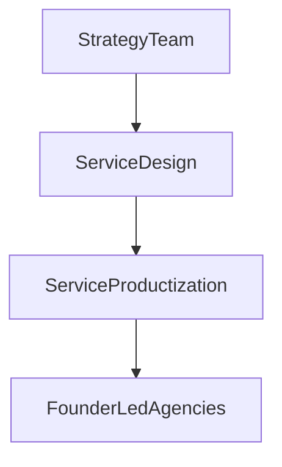
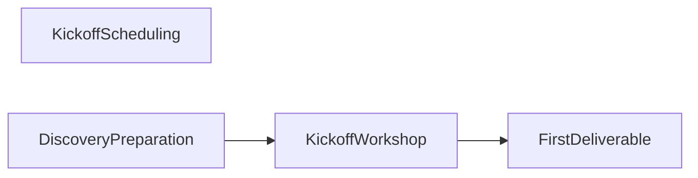
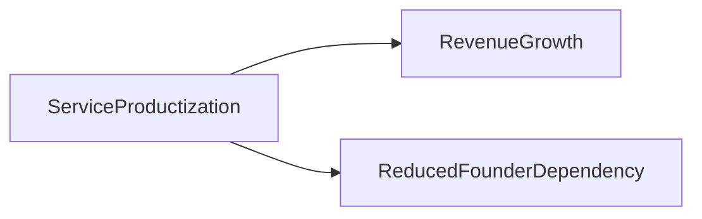
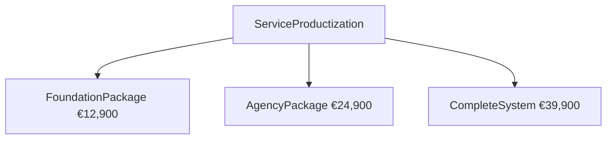

# Output Formats

Supported output formats from CSL models, when to use each, and how to generate them.

---

## 1. Output Format Overview

| Format | File Extension | Primary Use |
|---|---|---|
| CSL Source | `.csl` | Human-authored model, version control |
| Graph Model JSON | `.json` | Machine processing, API interchange, agent reasoning |
| Mermaid Diagram | `.md` | Embedded diagrams in Markdown docs |
| Graphviz DOT | `.dot` / `.svg` | High-quality static diagrams |
| Neo4j Cypher | `.cypher` | Graph database import |
| CSV Export | `.csv` | Spreadsheet analysis |
| HTML Report | `.html` | Stakeholder-facing reports |

---

## 2. CSL Source (`.csl`)

The primary authored format. UTF-8 plain text.

### When to use
- Storing the model in version control (Git)
- Human editing
- Input to all other pipeline tools

### File naming convention

```
model.csl                    – single file model
asis/model.csl               – AS-IS state
tobe/model.csl               – TO-BE state
asis/segments.csl            – split model: segments only
asis/offerings.csl           – split model: offerings only
```

### File header convention

```csl
// ============================================
// Company Name — AS-IS / TO-BE Model
// Version: 1.0
// Author: Your Name
// Date: YYYY-MM-DD
// ============================================
```

---

## 3. Graph Model JSON (`.json`)

The canonical machine-readable representation of a CSL model. Generated by the transformation step.

### Schema

```json
{
  "meta": {
    "modelVersion": "1.0",
    "cslVersion": "1.0",
    "companyId": "acme-consulting",
    "state": "asis",
    "snapshotDate": "2024-03-15T10:30:00Z",
    "generatedAt": "2024-03-15T10:30:00Z",
    "generator": "csl-transformer-v1.0",
    "author": "string",
    "project": "string"
  },
  "nodes": [
    {
      "id": "offering:ServiceProductization",
      "type": "offering",
      "name": "ServiceProductization",
      "attributes": {
        "description": "Transform custom services into packaged offerings",
        "economics": {
          "avgDealSize": 24900,
          "targetMargin": 0.65
        }
      },
      "computed": {
        "centralityScore": 0.92,
        "impactScore": 0.88,
        "complexity": "high"
      }
    }
  ],
  "edges": [
    {
      "from": "offering:ServiceProductization",
      "to": "segment:FounderLedAgencies",
      "type": "targets",
      "attributes": {
        "priority": "primary",
        "fitScore": 0.95
      },
      "computed": {
        "weight": 1.1,
        "criticalPath": true
      }
    }
  ]
}
```

### Node ID format
Always `<entityType>:<EntityName>`, e.g., `offering:ServiceProductization`, `team:StrategyTeam`.

### When to use
- Passing the model between tools
- Agent reasoning (agents should load this, not parse raw CSL)
- Visualization input
- Analytics queries

---

## 4. Mermaid Diagrams (`.md`)

Mermaid is embedded directly in Markdown. Supported by GitHub, Notion, and most documentation tools.

### Available View Types

#### 4.1 Architecture View

Segments → Offerings → Capabilities → Teams



#### 4.2 Process Flow View

Process → Steps with dependency arrows



#### 4.3 Value Stream View

Offerings → Outcomes → Economic Value



#### 4.4 Package Architecture View



### Generation Output Format

Each diagram is wrapped in a Mermaid code fence:

````markdown

````

### File naming

```
output/architecture.md
output/process-flow.md
output/value-stream.md
output/package-architecture.md
```

---

## 5. Graphviz DOT (`.dot`)

For more complex, publication-quality diagrams.

### Sample output



```dot
digraph CompanyArchitecture {
    rankdir=LR;
    node [shape=box, style=filled];

    "offering:ServiceProductization" [label="ServiceProductization\n(offering)", fillcolor="#4C9BE8", fontcolor=white];
    "segment:FounderLedAgencies" [label="FounderLedAgencies\n(segment)", fillcolor="#6EC96E", fontcolor=white];
    "capability:ServiceDesign" [label="ServiceDesign\n(capability)", fillcolor="#F4A940", fontcolor=white];
    "team:StrategyTeam" [label="StrategyTeam\n(team)", fillcolor="#E85C5C", fontcolor=white];

    "offering:ServiceProductization" -> "segment:FounderLedAgencies" [label="targets"];
    "capability:ServiceDesign" -> "offering:ServiceProductization" [label="supports"];
    "team:StrategyTeam" -> "capability:ServiceDesign" [label="owns"];
}
```

### Convert to SVG

```bash
dot -Tsvg output/architecture.dot -o output/architecture.svg
```

### Color Convention

| Entity Type | Color |
|---|---|
| company | #2C3E50 |
| offering | #4C9BE8 |
| segment | #6EC96E |
| market | #8EC9C9 |
| outcome | #A569BD |
| capability | #F4A940 |
| process | #E8C94C |
| step | #F0E04C |
| team | #E85C5C |
| role | #F09090 |
| package | #52D9A0 |
| system | #95A5A6 |
| objective | #E74C3C |
| metric | #1ABC9C |

---

## 6. Neo4j Cypher (`.cypher`)

For importing the CSL model into a Neo4j graph database for advanced queries.

### Sample output

```cypher
// Nodes
CREATE (:offering {id: "offering:ServiceProductization", name: "ServiceProductization", description: "Transform custom services", avgDealSize: 24900});
CREATE (:segment {id: "segment:FounderLedAgencies", name: "FounderLedAgencies"});
CREATE (:capability {id: "capability:ServiceDesign", name: "ServiceDesign", criticality: "high"});

// Relationships
MATCH (a {id: "offering:ServiceProductization"}) MATCH (b {id: "segment:FounderLedAgencies"}) CREATE (a)-[:TARGETS {priority: "primary", fitScore: 0.95}]->(b);
MATCH (a {id: "capability:ServiceDesign"}) MATCH (b {id: "offering:ServiceProductization"}) CREATE (a)-[:SUPPORTS]->(b);
```

### Useful Cypher queries after import

```cypher
// Find all offerings and their segments
MATCH (o:offering)-[:TARGETS]->(s:segment) RETURN o.name, s.name;

// Find capabilities without owning teams
MATCH (c:capability) WHERE NOT (c)-[:OWNED_BY]->() RETURN c.name;

// Find critical path from company to outcomes
MATCH path = (c:company)-[*..6]->(:outcome) RETURN path LIMIT 5;

// Impact analysis: what depends on this capability?
MATCH (dep)-[:REQUIRES]->(c:capability {name: "ServiceDesign"}) RETURN dep.name, dep.type;
```

---

## 7. CSV Export (`.csv`)

For spreadsheet analysis. One CSV per entity type.

### Node CSV format

```csv
id,type,name,description,centralityScore,impactScore,complexity
offering:ServiceProductization,offering,ServiceProductization,"Transform custom services",0.92,0.88,high
segment:FounderLedAgencies,segment,FounderLedAgencies,"Marketing agencies",0.45,0.0,low
```

### Edge CSV format

```csv
from,to,type,weight,criticalPath
offering:ServiceProductization,segment:FounderLedAgencies,targets,1.1,true
capability:ServiceDesign,offering:ServiceProductization,supports,1.0,true
```

---

## 8. HTML Report (`.html`)

Stakeholder-facing report combining key model information.

### Recommended sections

1. **Company Overview** — name, description, markets, objectives
2. **Offering Portfolio** — all offerings with economics and performance metrics
3. **Segment Analysis** — segments with problems, motivations, buying behavior
4. **Capability Map** — table of capabilities × offerings × teams
5. **Package Architecture** — all packages with pricing per offering
6. **Process Overview** — list of core processes with metrics
7. **Strategic Alignment** — objectives with contributing offerings and current metrics
8. **Validation Summary** — any warnings or suggestions from model validation

### Generation approach

Use the graph model JSON as input. Pick a simple HTML template and fill sections by querying the `nodes` and `edges` arrays filtered by entity type.

---

## 9. Choosing the Right Output

| Audience / Use Case | Recommended Output |
|---|---|
| AI agent reasoning about the company | Graph Model JSON |
| Developer integrating with the model | Graph Model JSON |
| Executive overview diagram | Mermaid or SVG (architecture view) |
| Operations team process documentation | Mermaid (process flow) |
| Sales team package overview | Mermaid (package architecture) |
| Graph database querying and analytics | Neo4j Cypher |
| Spreadsheet analysis | CSV export |
| Stakeholder presentation | HTML report |
| Version control and editing | CSL source |
| Proposal generation (Quotera) | Quotera Company Profile Export |

---

## 10. Quotera Company Profile Export

Generates the 5 Markdown knowledge files consumed by [celvaron-quotera](https://github.com/celvaron/celvaron-quotera) to auto-write proposals. Use the `/export-company-profile` command to produce these files from any TO-BE model.

### Output location

```
exports/{company-slug}/knowledge/
  about.md
  services.md
  pricing-guidelines.md
  tone-of-voice.md
  case-studies.md
```

Copy the entire `exports/{company-slug}/knowledge/` folder to `companies/{company-slug}/knowledge/` in the Quotera repo.

---

### Entity → Quotera file mapping

| Quotera file | CSL source |
|---|---|
| `about.md` | `company` (name, description, industry, size, headquarters, founded, website) · top `objective` as mission · `capability` entities where `differentiator: true` as core differentiators · `system` entities as technology & approach |
| `services.md` | `offering` entities (name, description, targets→segment names as context, delivers→outcome names); offerings with `changeType: "retired"` or `"removed"` → **What We Don't Do** section |
| `pricing-guidelines.md` | `package` entities (tier, price, billingCycle, currency, features); `pricingModel` entities (type, description); `meta.notes` for any agent pricing rules |
| `tone-of-voice.md` | `company.voice` block (tone, formality, perspective, language, dos, donts, examplePhrases) |
| `case-studies.md` | `caseStudy` entities (client, industry, challenge, solution, outcome, technologies) |

---

### Output file format

Each generated file must **exactly match** the Quotera `_template/knowledge/` placeholder structure so the proposal-writer agent can consume it without modification.

#### `about.md`

```markdown
# About {COMPANY}

## Company Overview
{company.description} — {company.industry}, {company.stage}.
Headquartered in {company.headquarters}. Founded {company.founded}.

## Mission
{company.objectives[0].description}

## Key Facts
- **Founded:** {company.founded}
- **Team size:** {sum of team.size for all teams}
- **Headquarters:** {company.headquarters}
- **Website:** {company.website if present}

## Core Differentiators
{bullet list of capabilities where differentiator: true, one per bullet}

## Technology & Approach
{bullet list of system entities with type + description}
```

#### `services.md`

```markdown
# Services — {COMPANY}

## Service Areas
{one H2 section per active offering: name as heading, description as body,
 outcomes it delivers as "Key outcomes:", packages as "Available tiers:"}

## What We Don't Do
{one bullet per offering with changeType: "retired" or "removed"}
```

#### `pricing-guidelines.md`

```markdown
# Pricing Guidelines — {COMPANY}

## Packages
{table: package name | tier | price | billingCycle | currency}

## Package Details
{one paragraph per package listing features[]}

## Pricing Model
{pricingModel entities: type + description}

## Notes for Agents
{any meta.notes from pricingModel or company entity relevant to pricing}
```

#### `tone-of-voice.md`

```markdown
# Tone of Voice — {COMPANY}

## Overall Tone
{company.voice.tone}

## Voice Characteristics
- **Formality:** {company.voice.formality}
- **Perspective:** {company.voice.perspective}
- **Language:** {company.voice.language}

## Do
{bullet list from company.voice.dos}

## Don't
{bullet list from company.voice.donts}

## Example Phrases
{bullet list from company.voice.examplePhrases}
```

#### `case-studies.md`

```markdown
# Case Studies — {COMPANY}

{for each caseStudy entity:}
## {caseStudy.client}
- **Industry:** {caseStudy.industry}
- **Challenge:** {caseStudy.challenge}
- **Solution:** {caseStudy.solution}
- **Outcome:** {caseStudy.outcome}
- **Technologies:** {caseStudy.technologies joined by ", "}
```

---

### Fallback rules when data is missing

| Missing data | Fallback |
|---|---|
| `company.voice` not present | Generate `tone-of-voice.md` with placeholder comments only |
| No `caseStudy` entities | Generate `case-studies.md` with placeholder comments only |
| No `differentiator: true` capabilities | List all active capabilities in Core Differentiators |
| No `pricingModel` entities | Omit Pricing Model section from `pricing-guidelines.md` |
| `company.website` not present | Omit Website from Key Facts |
