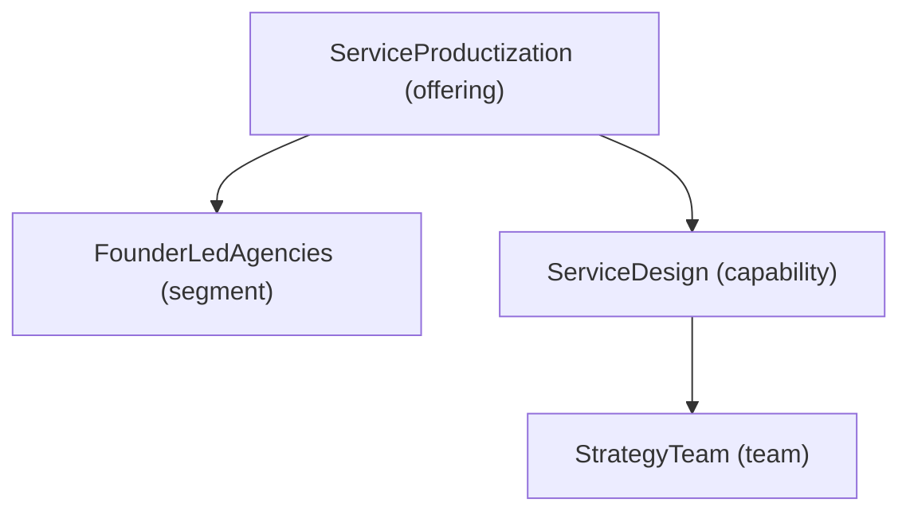

# Tool Usage Guide

This guide explains how to use the CSL tools included in the `/tools/` directory.

---

## Prerequisites

- Python 3.9+
- No external dependencies required (all tools use the standard library)

---

## Tools Overview

| Tool | Purpose |
|---|---|
| `validate_csl.py` | Validate a `.csl` file for syntax, references, and structure |
| `transform_csl.py` | Transform a `.csl` file into a canonical JSON graph model |
| `generate_diagram.py` | Generate a Mermaid diagram from a graph model JSON |
| `parse_input.py` | Convert a CSV or JSON data file into a CSL scaffold |

---

## validate_csl.py

Checks a `.csl` file for errors and warnings.

### Usage

```bash
python tools/validate_csl.py <path-to-csl-file> [options]
```

### Options

| Option | Description |
|---|---|
| `--strict` | Treat warnings as errors |
| `--json` | Output results as JSON instead of plain text |
| `--quiet` | Only print errors, suppress warnings |

### Examples

```bash
# Validate a model
python tools/validate_csl.py examples/minimal_model.csl

# Validate with strict mode
python tools/validate_csl.py examples/advanced_model.csl --strict

# Get machine-readable output
python tools/validate_csl.py examples/advanced_model.csl --json
```

### Output Format

```
CSL Validation Report
=====================
File: examples/advanced_model.csl

ERRORS (0):
  None

WARNINGS (2):
  W001 [offering:StrategyAdvisory] Offering has no performance metrics defined
  W002 [process:ClientOnboarding] Process has no metrics block

SUGGESTIONS (1):
  S001 Model has fewer than 5 capabilities — consider expanding capability coverage

Result: VALID (2 warnings)
```

---

## transform_csl.py

Parses a `.csl` file and outputs a canonical JSON graph model.

### Usage

```bash
python tools/transform_csl.py <path-to-csl-file> [options]
```

### Options

| Option | Description |
|---|---|
| `-o <path>` | Output file path (default: stdout) |
| `--pretty` | Pretty-print the JSON output |
| `--state <asis|tobe>` | Set model state in meta |
| `--author <name>` | Set author in meta |

### Examples

```bash
# Transform to graph model, print to stdout
python tools/transform_csl.py examples/minimal_model.csl --pretty

# Transform and save to file
python tools/transform_csl.py examples/advanced_model.csl -o output/graph.json --pretty

# Transform with metadata
python tools/transform_csl.py asis/model.csl -o output/asis_graph.json --state asis --author "John Doe"
```

### Output Structure

```json
{
  "meta": {
    "modelVersion": "1.0",
    "cslVersion": "1.0",
    "companyId": "acme-consulting",
    "state": "asis",
    "generatedAt": "2024-03-15T10:30:00Z"
  },
  "nodes": [
    {
      "id": "company:AcmeConsulting",
      "type": "company",
      "name": "AcmeConsulting",
      "attributes": { "name": "Acme Consulting" }
    }
  ],
  "edges": [
    {
      "from": "offering:ServiceProductization",
      "to": "segment:FounderLedAgencies",
      "type": "targets",
      "attributes": { "priority": "primary", "fitScore": 0.95 }
    }
  ]
}
```

---

## generate_diagram.py

Generates a Mermaid diagram from a graph model JSON file.

### Usage

```bash
python tools/generate_diagram.py <path-to-graph-json> [options]
```

### Options

| Option | Description |
|---|---|
| `--view <view-type>` | View type to generate (see below) |
| `-o <path>` | Output file path (default: stdout) |
| `--title <text>` | Add a title to the diagram |

### Available View Types

| View | Description |
|---|---|
| `architecture` | Company → Offerings → Capabilities → Teams |
| `capability-map` | Teams → Capabilities → Offerings |
| `process-flow` | Process → Steps with dependencies |
| `value-stream` | Offerings → Outcomes → Economic Value |
| `package-architecture` | Offering → Package tiers |

### Examples

```bash
# Generate architecture overview
python tools/generate_diagram.py output/graph.json --view architecture

# Generate process flow, save to file
python tools/generate_diagram.py output/graph.json --view process-flow -o output/process.md

# Generate value stream with title
python tools/generate_diagram.py output/graph.json --view value-stream --title "Acme Value Stream"
```

### Output Format

The tool outputs a Mermaid code block ready to embed in Markdown:

````markdown

````

---

## parse_input.py

Converts structured input data (CSV or JSON) into a CSL scaffold. Useful as a starting point when building a CSL model from existing data.

### Usage

```bash
python tools/parse_input.py <path-to-input-file> [options]
```

### Options

| Option | Description |
|---|---|
| `--format <csv|json>` | Input format (auto-detected if not provided) |
| `--entity <type>` | Target CSL entity type to generate |
| `-o <path>` | Output `.csl` file path |

### Supported Input Formats

#### CSV → CSL

CSV columns map to entity fields. Example `offerings.csv`:

```csv
name,description,targetSegment,avgDealSize,targetMargin
ServiceProductization,"Transform custom services",FounderLedAgencies,24900,0.65
StrategyAdvisory,"Strategic advisory for founders",SolopreneurConsultants,12000,0.70
```

```bash
python tools/parse_input.py data/offerings.csv --entity offering -o output/offerings.csl
```

#### JSON → CSL

JSON objects map to entity fields. Example `company.json`:

```json
{
  "name": "Acme Consulting",
  "description": "Strategy advisory for service businesses",
  "headquarters": "Berlin, Germany",
  "founded": 2018
}
```

```bash
python tools/parse_input.py data/company.json --entity company -o output/company.csl
```

### Output

The tool generates a scaffolded `.csl` file with all provided fields populated and a comment indicating any missing required fields:

```csl
// Generated by parse_input.py — review and complete before validating

offering ServiceProductization {
  description: "Transform custom services"
  targets: [FounderLedAgencies]  // TODO: verify segment exists
  economics: {
    avgDealSize: 24900
    targetMargin: 0.65
  }
  // TODO: requires (required field — add 1+ capabilities)
  // TODO: delivers (required field — add 1+ outcomes)
}
```

---

## Typical Workflow

```bash
# 1. (Optional) Generate CSL scaffold from existing data
python tools/parse_input.py data/company.json --entity company -o draft/company.csl

# 2. Author or complete your CSL model manually
# (edit draft/ files or write from scratch using templates/)

# 3. Validate the model
python tools/validate_csl.py my_model.csl

# 4. Transform to graph model
python tools/transform_csl.py my_model.csl -o output/graph.json --pretty

# 5. Generate a diagram
python tools/generate_diagram.py output/graph.json --view architecture -o output/architecture.md
```
