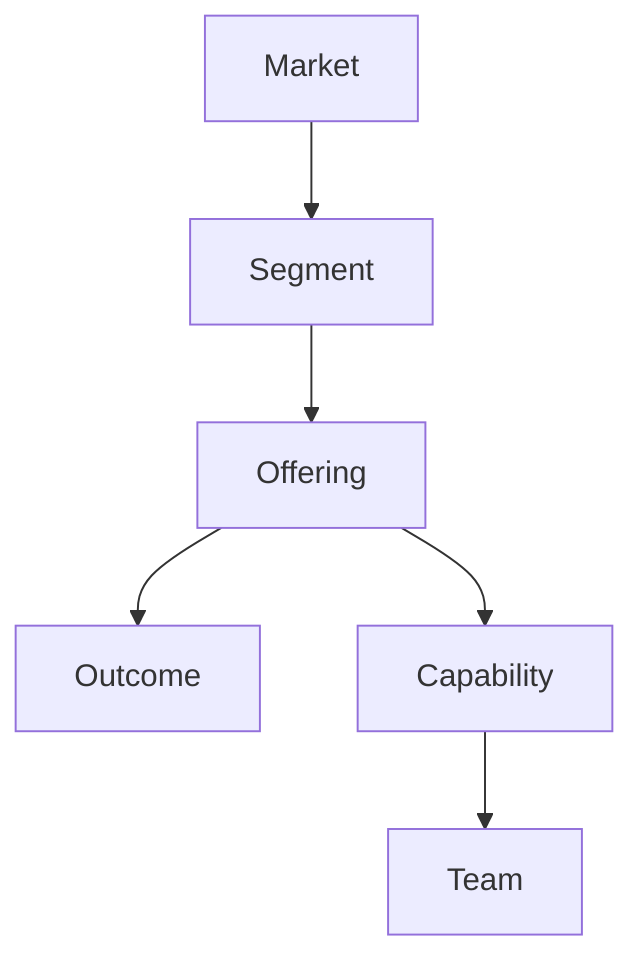
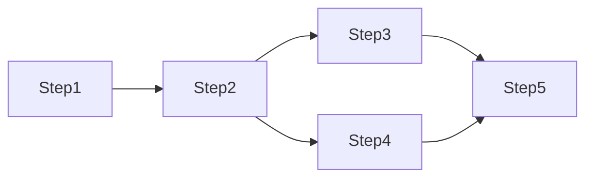
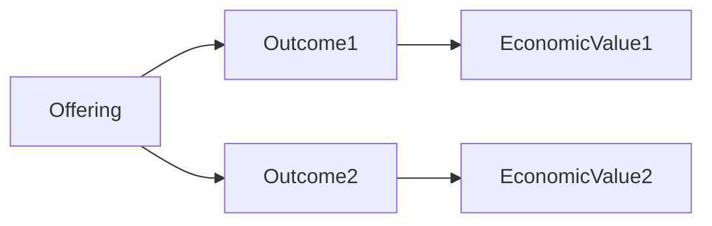
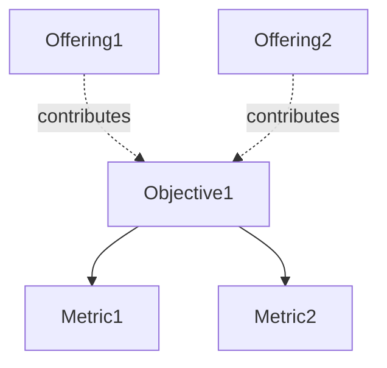

# CSL Visualization System

CSL generates diagrams directly from the graph model — you never draw diagrams manually. One model produces many views, each showing a different perspective on the company.

---

## How It Works

```
CSL Graph Model
       ↓
  View Generator (applies view config)
       ↓
  View-Specific Graph (filtered/transformed)
       ↓
  Renderer (Mermaid / D3 / React Flow)
       ↓
  Visual Output
```

Run any view with:

```bash
python tools/generate_diagram.py output/graph.json --view <view-name> --title "Company Name"
```

---

## Standard Views

### `architecture` — Company Architecture
**Focus:** Segments, offerings, capabilities, outcomes  
**Purpose:** Strategic overview of the whole company  
**Best for:** Executives, board presentations, first-look summaries



---

### `capability-map` — Capability Map
**Focus:** Teams, capabilities, offerings  
**Purpose:** Understand who owns what and where gaps exist  
**Best for:** Org design, hiring plans, capability building

```
           Offering A    Offering B    Offering C
           --------      --------      --------
Team 1  →  Cap1, Cap2    Cap1         -
Team 2  →  Cap3          Cap3, Cap4    Cap4
Team 3  →  -             -             Cap5, Cap6
```

---

### `process-flow` — Process Flow
**Focus:** Processes, steps, dependencies  
**Purpose:** Understand operational workflows  
**Best for:** Operations, delivery teams, automation design



---

### `service-blueprint` — Service Blueprint
**Focus:** Steps, teams, systems, touchpoints  
**Purpose:** End-to-end service design across swim lanes  
**Best for:** Service design, QA, training materials

```
Customer Actions:  [Inquiry] → [Meeting] → [Review] → [Approval]
Frontstage:       [Call] → [Workshop] → [Presentation] → [Contract]
Backstage:        [Research] → [Analysis] → [Proposal Dev]
Support:          [CRM] → [Miro] → [Docs] → [DocuSign]
```

---

### `value-stream` — Value Stream
**Focus:** Offerings, outcomes, economic value  
**Purpose:** Trace value creation from delivery to revenue  
**Best for:** Pricing decisions, investment prioritization



---

### `strategy-map` — Strategy Map
**Focus:** Objectives, metrics, contributions  
**Purpose:** Link offerings to strategic goals  
**Best for:** OKR reviews, strategic alignment sessions



---

### `operating-model` — Operating Model Canvas
**Focus:** Teams, capabilities, offerings, processes  
**Purpose:** Full operating model on one page  
**Best for:** Transformation planning, new leadership onboarding

```
┌────────────────┬───────────────┬────────────────┐
│ Team Structure │ Capabilities  │ Offerings      │
├────────────────┼───────────────┼────────────────┤
│ • Strategy     │ • Design      │ • Productize   │
│ • Delivery     │ • Analysis    │ • Strategy     │
│ • Success      │ • Facilitation│ • Advisory     │
└────────────────┴───────────────┴────────────────┘
         ↓               ↓               ↓
┌──────────────────────────────────────────────────┐
│             Processes & Workflows                 │
└──────────────────────────────────────────────────┘
```

---

### `journey-map` — Client Journey Map
**Focus:** Journey phases, touchpoints, processes  
**Purpose:** Understand the client experience from first contact to renewal  
**Best for:** Sales enablement, CX improvement, onboarding design

```
Awareness → Evaluation → Purchase → Onboarding → Active → Renewal
   |            |           |           |          |         |
Content    Discovery    Proposal   Process    Support   Review
           Workshop     Review     Execution
```

---

### `package-architecture` — Package Architecture
**Focus:** Offerings, packages, pricing  
**Purpose:** Commercial structure at a glance  
**Best for:** Sales team reference, website packaging, pricing reviews

```
Offering
  ├─ Foundation Package (€12,900)
  ├─ Agency Package (€24,900)
  └─ Complete System (€39,900)
```

---

### `change-impact` — Change Impact Map (AS-IS vs TO-BE)
**Focus:** Entity changes and their dependencies  
**Purpose:** Understand what's changing and what it affects  
**Best for:** Transformation programmes, change management planning

```
Green  = New
Yellow = Modified
Red    = Removed
Gray   = Unchanged
```

---

## Choosing the Right View by Audience

| Audience | Recommended Views |
|---|---|
| Executives / Board | `architecture`, `value-stream`, `strategy-map` |
| Operations | `process-flow`, `service-blueprint`, `operating-model` |
| Product / Commercial | `package-architecture`, `journey-map` |
| HR / Org Design | `capability-map` |
| Transformation | `change-impact`, `operating-model` |

---

## Renderer Support

| Renderer | Best for |
|---|---|
| **Mermaid** | Process flows, strategy maps, simple hierarchies |
| **Graphviz** | Complex networks, capability maps, full architecture |
| **D3.js** | Interactive visualizations, analytics dashboards |
| **React Flow** | Interactive editing, real-time collaboration |
| **Neo4j Browser** | Graph exploration, relationship queries |

The `generate_diagram.py` tool outputs Mermaid by default. See [tool-usage.md](tool-usage.md) for renderer options.
